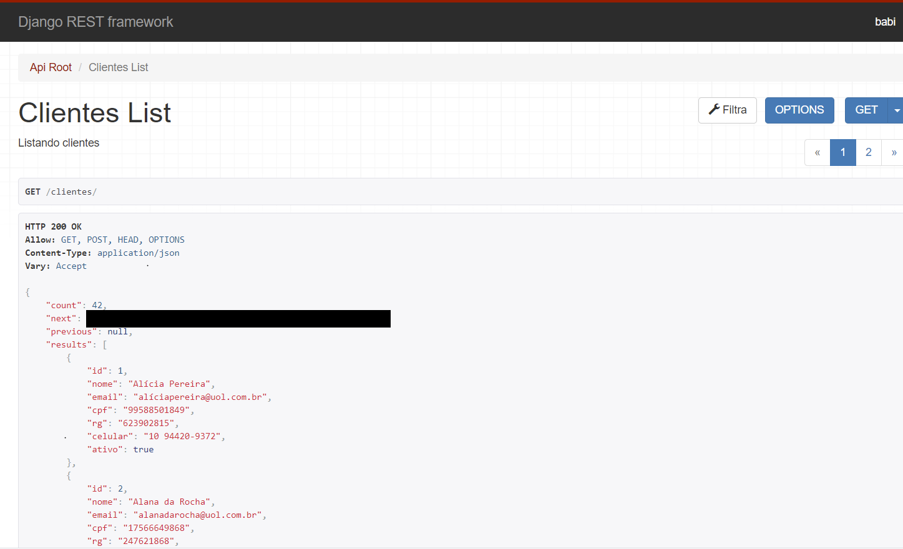
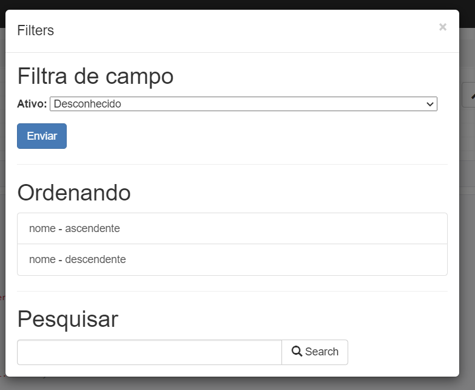
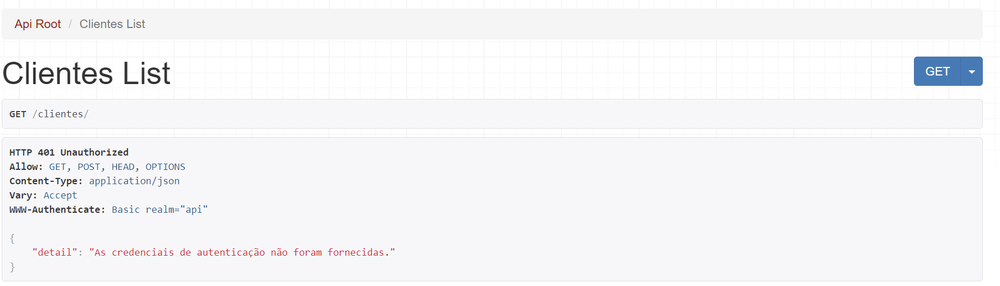

 <!-- Explicação do projeto -->
<h1 align="center">django-rest-framework-API-clientes</h1>
<h2 align="center">Descrição do Projeto</h2>

 Desenvolvimento de um uma API de clientes em Python com o framework Django 

 <!-- Status do projeto -->
 <h2 align="center">Status</h2>
<h4 align="center"> 
	 🚧 API Clientes 🚀 Em contrução...  🚧
</h4>

<!-- Indice -->

 <a href="#objetivo">Objetivo</a> •
 <a href="#roadmap">Roadmap</a> • 
 <a href="#tecnologias">Tecnologias</a> • 
 <a href="#contribuicao">Contribuição</a> • 
 <a href="#licenc-a">Licença</a> • 
 <a href="#autor">Autor</a>

<!-- Tecnologias envolvidas -->

	<h2 align="center"> 🛠 Tecnologias envolvidas</h2>
	

		
		
		
		
		
		
	

<!-- Requirements -->

	<h2 align="center"> Pré-requisitos </h2>
	
$ pip install requirements.txt

Requirements.txt content |	
------------
asgiref==3.2.10
astroid==2.4.2
colorama==0.4.4
dj-database-url==0.5.0
Django==3.0.8
django-filter==2.4.0
django-heroku==0.3.1
djangorestframework==3.11.0
Faker==8.9.1
gunicorn==20.0.4
isort==4.3.21
lazy-object-proxy==1.4.3
mccabe==0.6.1
postgres==3.0.0
psycopg2==2.8.6
psycopg2-binary==2.8.6
psycopg2-pool==1.1
pylint==2.5.3
python-dateutil==2.8.1
python-decouple==3.4
pytz==2020.1
six==1.15.0
sqlparse==0.3.1
text-unidecode==1.3
toml==0.10.1
typed-ast==1.4.1
validate-docbr==1.8.2
whitenoise==5.2.0
wrapt==1.12.1

<!-- Resultados -->
<!-- Resultado API -->

	<h2 align="center"> ⚡ Resultados API ⚡</h2>

<!-- Resultados parciais -->

	<h3 align="center"> ➡ Acesso à API - JSON com campos validados, Paginação ⬅</h3>
	

<!-- Resultados parciais -->

	<h3 align="center"> ➡  Filtros e ordenação dos dados ⬅</h3>
	

<!-- Resultados parciais -->

	<h3 align="center"> ➡  Autenticação de usuário ⬅</h3>
	

													
<!-- Resultados parciais -->

	<h3 align="center"> ➡  Acesso negado caso não tenha cadastro parar acesso à API ⬅</h3>
	

													
													

